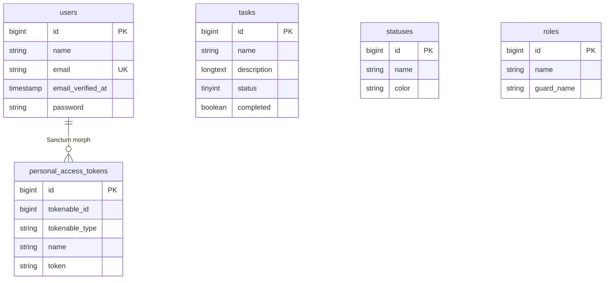

# Database Schema — Task Manager

> Analysis based on migrations, models, and seeders — 2026-07-12

---

## Existing Tables

| Table | Model | Migration | Used in the Codebase |
|-------|-------|-----------|----------------------|
| `users` | `User` | `0001_01_01_000000_create_users_table.php` | ✅ |
| `tasks` | `Task` | `2026_05_29_085546_create_tasks_table.php` | ✅ |
| `statuses` | `Status` | `2026_05_29_091832_create_statuses_table.php` | ⚠️ Seed only |
| `roles` | Spatie `Role` | `2026_06_16_201701_create_permission_tables.php` | ⚠️ Read API only |
| `permissions` | Spatie `Permission` | Same migration | ❌ Not used |
| `model_has_roles` | — | Same migration | ❌ |
| `model_has_permissions` | — | Same migration | ❌ |
| `role_has_permissions` | — | Same migration | ❌ |
| `personal_access_tokens` | — | `2026_06_22_192003_create_personal_access_tokens_table.php` | ✅ Sanctum |
| `sessions` | — | Users migration | ✅ |
| `password_reset_tokens` | — | Users migration | ✅ |
| `cache` / `cache_locks` | — | `0001_01_01_000001_create_cache_table.php` | ✅ |
| `jobs` / `job_batches` / `failed_jobs` | — | `0001_01_01_000002_create_jobs_table.php` | ⚠️ Available but unused |

---

## Domain Table Details

### `users`

| Field | Type | Notes |
|-------|------|-------|
| `id` | bigint PK | |
| `name` | string | |
| `email` | string unique | |
| `email_verified_at` | timestamp nullable | |
| `password` | string | Cast: `hashed` |
| `remember_token` | string | |
| `timestamps` | | |

**Model relationships:**
- `hasMany(Task)` — ⚠️ **The `tasks` table does not contain a `user_id` column**

---

### `tasks`

| Field | Type | Notes |
|-------|------|-------|
| `id` | bigint PK | |
| `name` | string | Required by the API |
| `description` | longText | Required by the API |
| `status` | tinyInteger default 1 | ⚠️ **Not a foreign key to `statuses`** |
| `completed` | boolean default false | |
| `timestamps` | | |

**Model relationships — inconsistent with the database:**
- `belongsTo(User)` — ❌ No `user_id` column
- `belongsTo(Status)` — ❌ The database has an integer `status` column, not `status_id`

**Mass-assignable fields (`$fillable`):** `name`, `description`, `status`, `completed`

---

### `statuses`

| Field | Type | Notes |
|-------|------|-------|
| `id` | bigint PK | |
| `name` | string | |
| `color` | string | |
| `timestamps` | | |

**Seeded values:** `to do`, `in Progress`, `completed`, `hold`

**Model relationships:**
- `hasMany(Task)` — ❌ The `tasks` table does not contain the required foreign key

---

### `Project` Model

- File: `app/Models/Project.php` — **empty class**
- **No migration exists**
- **No `projects` table exists**

---

## Task Manager Entities — Current Status

| Concept | Exists? | Evidence |
|---------|---------|----------|
| User | ✅ Confirmed | `users` table and `User` model |
| Workspace / Team | ❌ Missing | — |
| Project | ❌ Skeleton only | Empty `Project` model; no migration |
| Task | ✅ Confirmed | `tasks` table and API CRUD |
| Task Status | ⚠️ Partial | `statuses` table is seeded, but `tasks.status` is a separate integer field |
| Priority | ❌ Missing | — |
| Assignee | ❌ Missing | No `user_id` on `tasks` |
| Creator | ❌ Missing | — |
| Due date | ❌ Missing | — |
| Comment | ❌ Missing | — |
| Attachment | ❌ Missing | — |
| Label / Tag | ❌ Missing | — |
| Activity log | ❌ Missing | — |
| Notification feature | ❌ Missing | — |

---

## ER Diagram — Confirmed Relationships Only



> **Note:** The `User → Task` and `Status → Task` relationships are defined in the models, but the database schema contains **no corresponding foreign keys**. They are intentionally omitted from the diagram.

---

## Critical Schema Inconsistencies

### 1. `tasks.status` vs. the `statuses` table

| Layer | Current behavior or expectation |
|-------|---------------------------------|
| Migration | `status` is a `tinyInteger` with a numeric default value of `1` |
| Model | `status()` uses `belongsTo(Status::class)` and therefore expects `status_id` |
| Controller validation | `'status' => 'nullable|string'` |
| API response | `"status": 1` as an integer |

**Status:** Broken / inconsistent

### 2. `Task::user()` without `user_id`

```php
// app/Models/Task.php:21-24
public function user(): BelongsTo
{
    return $this->belongsTo(User::class);
}
```

The `create_tasks_table` migration does not define a `user_id` column.

### 3. `Status::$fillable` contains only `name`

The seeder assigns a `color` value (`DatabaseSeeder:31-47`). This works because the factory/state sets attributes directly, but `color` is not included in `$fillable`, so mass assignment through an API would be blocked.

### 4. Empty `StatusFactory`

```php
// database/factories/StatusFactory.php:20-22
return [
    //
];
```

### 5. Empty `TaskSeeder`

`database/seeders/TaskSeeder.php` contains an empty `run()` method.

---

## Indexes and Foreign Keys

| Issue | Severity |
|-------|----------|
| No `user_id` foreign key on `tasks` | Important |
| No `status_id` foreign key on `tasks` | Important |
| No index on `tasks.status` | Optional for the current small table |
| Permission tables use the standard Spatie indexes | OK |
