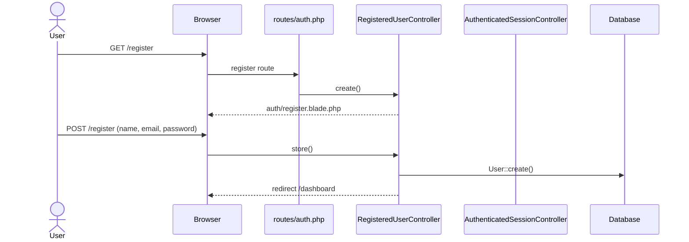
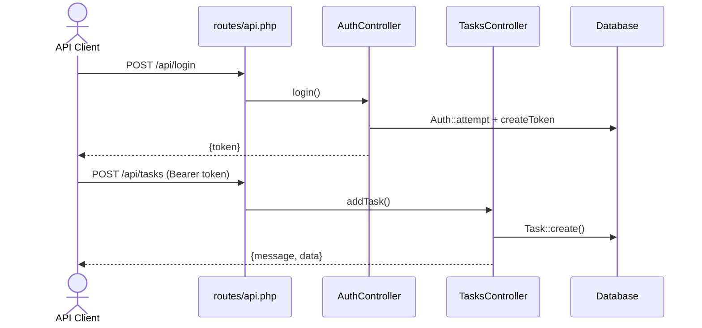
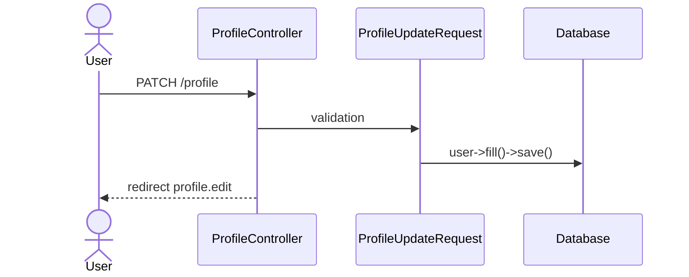

# Feature Status — Task Manager MVP

> Every conclusion includes its evidence path and confidence level.

---

## Legend

| Status | Meaning |
|--------|---------|
| ✅ Complete | The full route → controller → model → response flow is implemented |
| ⚠️ Partial | Some functionality exists, but it is incomplete or inconsistent |
| 🦴 Skeleton | A file or structure exists, but it contains no meaningful logic |
| ❌ Not implemented | The feature does not exist |
| ❓ Uncertain | Manual confirmation is required |

---

## Feature Completeness Matrix

| Module | Expected MVP capability | Current status | Evidence | Missing work | Risk |
|--------|-------------------------|----------------|----------|--------------|------|
| Project setup | Runnable Laravel application and dependencies | **Mostly done** | `composer.json`; migration and seed succeed; tests pass | Custom README, Docker, CI | Low |
| Authentication | Login and registration | **Mostly done** | Breeze `routes/auth.php`; 19 authentication tests pass | Web/API authentication alignment | Medium |
| User profile | Edit profile, password, and account deletion | **Done** | `ProfileController`; `ProfileTest` with 5 passing tests | — | Low |
| Workspace/team | Multi-tenant teams | **Not started** | — | Migrations, models, UI | High if required |
| Project management | Project CRUD | **Started, incomplete** | Empty `Project.php`; no migration | Entire feature | High |
| Task CRUD | Create, read, update, and delete tasks | **In progress** | `TasksController`; `routes/api.php`; API manually tested | UI, ownership scoping, schema fixes | High |
| Task assignment | Assign a task to a user | **Not started** | `Task::user()` exists without `user_id` | Migration and application logic | High |
| Task statuses | Status workflow | **Started, incomplete** | `statuses` is seeded; `tasks.status` is an integer | Foreign key and controller alignment | High |
| Task priorities | Priority field | **Not started** | — | Migration, model, UI | Medium |
| Due dates | `due_date` on tasks | **Not started** | — | Migration and validation | Medium |
| Comments | Task comments | **Not started** | — | Model, migration, UI | Medium |
| Labels/tags | Task categorization | **Not started** | — | Entire feature | Low |
| Task filtering/search | Filtered and searchable task list | **Not started** | `getAll()` uses `Task::all()` | Query scopes and request parameters | Medium |
| Authorization | Role-based access control | **Started, incomplete** | Spatie package installed; `HasRoles` used by `User` | Policies and permission checks | High |
| Validation | Request input validation | **In progress** | Inline Task API validation; Breeze Form Requests | Dedicated Form Request classes for the API | Medium |
| Error handling | Consistent error responses | **Started, incomplete** | Some 404 responses do not set an HTTP status code | Standardize API errors | Medium |
| Notifications | User notifications | **Not started** | — | Entire feature | Low |
| Dashboard | Task overview | **Started, incomplete** | `dashboard.blade.php` only displays a login message | Task widgets and statistics | Medium |
| Frontend usability | Task management UI | **Started, incomplete** | Breeze UI exists; no task pages | Task views and frontend behavior | High |
| Tests | Feature coverage | **Started, incomplete** | 25 tests, covering only authentication and profiles | Task, Role, and API tests | High |
| Seed/demo data | Demo users and tasks | **Started, incomplete** | Four statuses and one user | Task seeding and role seeding | Low |
| Documentation | Project documentation | **Not started** → **Done** | These documentation files | Update `README.md` | Low |
| Deployment | Production readiness | **Not started** | No Docker, CI, or Nginx configuration | Infrastructure setup | Medium |

---

## Route Inventory

### Web Routes — `routes/web.php` and `routes/auth.php`

| Method | URI | Name | Controller | Middleware | Auth | Status |
|--------|-----|------|------------|------------|------|--------|
| GET | `/` | — | Closure → welcome | — | No | ✅ Complete |
| GET | `/dashboard` | dashboard | Closure → dashboard | `auth`, `verified` | Yes | 🦴 Skeleton UI |
| GET | `/profile` | profile.edit | `ProfileController@edit` | `auth` | Yes | ✅ Complete |
| PATCH | `/profile` | profile.update | `ProfileController@update` | `auth` | Yes | ✅ Complete |
| DELETE | `/profile` | profile.destroy | `ProfileController@destroy` | `auth` | Yes | ✅ Complete |
| GET | `/register` | register | `RegisteredUserController@create` | `guest` | No | ✅ Complete |
| POST | `/register` | — | `RegisteredUserController@store` | `guest` | No | ✅ Complete |
| GET | `/login` | login | `AuthenticatedSessionController@create` | `guest` | No | ✅ Complete |
| POST | `/login` | — | `AuthenticatedSessionController@store` | `guest` | No | ✅ Complete |
| POST | `/logout` | logout | `AuthenticatedSessionController@destroy` | `auth` | Yes | ✅ Complete |
| GET | `/forgot-password` | password.request | `PasswordResetLinkController@create` | `guest` | No | ✅ Complete |
| POST | `/forgot-password` | password.email | `PasswordResetLinkController@store` | `guest` | No | ✅ Complete |
| GET | `/reset-password/{token}` | password.reset | `NewPasswordController@create` | `guest` | No | ✅ Complete |
| POST | `/reset-password` | password.store | `NewPasswordController@store` | `guest` | No | ✅ Complete |
| GET | `/verify-email` | verification.notice | `EmailVerificationPromptController` | `auth` | Yes | ✅ Complete |
| GET | `/verify-email/{id}/{hash}` | verification.verify | `VerifyEmailController` | `auth`, `signed`, `throttle` | Yes | ✅ Complete |
| POST | `/email/verification-notification` | verification.send | `EmailVerificationNotificationController@store` | `auth`, `throttle` | Yes | ✅ Complete |
| GET | `/confirm-password` | password.confirm | `ConfirmablePasswordController@show` | `auth` | Yes | ✅ Complete |
| POST | `/confirm-password` | — | `ConfirmablePasswordController@store` | `auth` | Yes | ✅ Complete |
| PUT | `/password` | password.update | `PasswordController@update` | `auth` | Yes | ✅ Complete |

### API Routes — `routes/api.php`

| Method | URI | Name | Controller | Middleware | Auth | Status |
|--------|-----|------|------------|------------|------|--------|
| POST | `/api/login` | — | `AuthController@login` | — | No | ⚠️ Partial: no register or logout |
| GET | `/api/tasks` | Tasks | `TasksController@getAll` | `auth:sanctum` | Token | ⚠️ Partial |
| GET | `/api/tasks/{id}` | Get One Task | `TasksController@getOne` | `auth:sanctum` | Token | ⚠️ Partial |
| POST | `/api/tasks` | Add Task | `TasksController@addTask` | `auth:sanctum` | Token | ⚠️ Partial |
| PUT | `/api/tasks/{id}` | Update Task | `TasksController@editTask` | `auth:sanctum` | Token | ⚠️ Partial |
| DELETE | `/api/tasks/{id}` | Delete Task | `TasksController@deleteTask` | `auth:sanctum` | Token | ⚠️ Partial |
| GET | `/api/roles` | Roles | `RolesController@getAll` | `auth:sanctum` | Token | ⚠️ Partial |
| POST | `/api/roles` | Add Role | `RolesController@addRole` | `auth:sanctum` | Token | ❌ Broken |

---

## Feature Details

### ✅ Web Authentication — Complete

**Traced flow:**
1. `GET /login` → `AuthenticatedSessionController@create` → `auth/login.blade.php`
2. `POST /login` → `LoginRequest` for rate limiting and validation → `Auth::attempt` → session regeneration → redirect to dashboard
3. Tests: `tests/Feature/Auth/*` — 19 tests pass

**Note:** The `User` model does not implement `MustVerifyEmail` because the interface is commented out in `User.php:5`, while the dashboard route uses the `verified` middleware. Newly registered users may therefore be redirected to the email-verification page depending on their verification state and framework behavior.

---

### ⚠️ API Authentication — Partial

**Traced flow:**
1. `POST /api/login` → `AuthController@login`
2. Validation: `email`, `password`
3. `Auth::attempt` → `createToken('task-manager-token')` → JSON response containing `{token}`
4. Protected routes use the `auth:sanctum` middleware

**Missing:** API registration, logout and token revocation, token refresh, and explicit standardized error status codes. The unauthorized response does not explicitly define a `401` status code.

---

### ⚠️ Task API — Partial

**Traced flow, confirmed through an HTTP test on 2026-07-12:**

| Action | Route | Validation | Database operation | Response |
|--------|-------|------------|--------------------|----------|
| List | `GET /api/tasks` | — | `Task::all()` | JSON `[[...]]`; contains an unnecessary extra array level |
| Show | `GET /api/tasks/{id}` | — | `Task::find($id)` | JSON object or a 404-style response |
| Create | `POST /api/tasks` | `name` and `description` required | `Task::create` | HTTP 200 with message and data |
| Update | `PUT /api/tasks/{id}` | All fields nullable | `findOrFail()->update()` | HTTP 200 or 500 |
| Delete | `DELETE /api/tasks/{id}` | — | `find()->delete()` | HTTP 200 even when the task is not found |

**Issues:**
- No user-level filtering: every authenticated user can retrieve all tasks
- `status` is validated as a string, while the database column is an integer
- Unused import: `TaskListExtension` in `TasksController.php:7`
- No Policy or permission checks

---

### ❌ Roles API — `addRole` Is Broken

```php
// RolesController.php:26-31
public function addRole(Request $request)
{
    $validate = $request->validate(['name' => 'required']);
    // No create operation and no response; the method ends here.
}
```

`getAll` works and returns either an empty list or the existing roles.

---

### 🦴 Dashboard — Skeleton

`resources/views/dashboard.blade.php` only displays `"You're logged in!"` and contains no task data.

---

### ❌ Task UI — Not Implemented

A search in `resources/views` for `task` or `Task` returned **no matching task-related views**.

---

## Confirmed User Flows

### Flow 1: Web Registration and Login



### Flow 2: API Login and Task Creation



### Flow 3: Profile Update



---

## Implemented vs. Missing Summary

| ✅ Implemented | ⚠️ Partial | ❌ Missing |
|----------------|------------|------------|
| Breeze web authentication | API authentication: login only | Task UI |
| Profile management | Task API CRUD | Project feature |
| Sanctum token authentication | Status system | Task assignment |
| Seeded status data | Roles and permissions | Comments, tags, and due dates |
| Basic dashboard page | Dashboard content | Filtering and search |
| 25 authentication/profile tests | Schema consistency | Task tests |
| | Response format | Deployment infrastructure |
