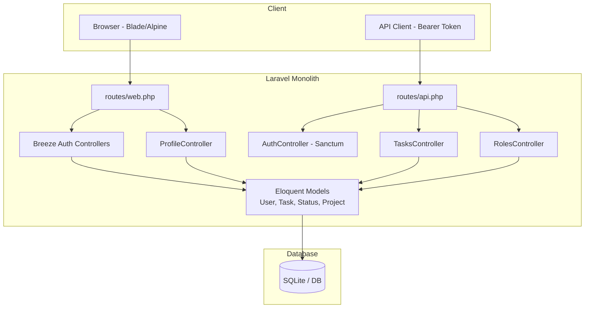

# Project Overview — Task Manager MVP

> Last inspected: 2026-07-12  
> Status: **Codebase analysis only — no application code was changed**

---

## Project Goal

Build an **MVP task-management application** with Laravel. In its current state, the project is primarily a **Laravel 12 + Breeze skeleton** with early Task and Role API work. The product's core experience, managing tasks through a user interface, has not yet been implemented.

---

## Technology Stack

| Layer | Technology | Confirmed version |
|-------|------------|-------------------|
| Backend | Laravel | v12.59.0 from `composer.lock` |
| Runtime | PHP | ^8.2 from `composer.json` |
| Web authentication | Laravel Breeze | ^2.4 development dependency; session-based |
| API authentication | Laravel Sanctum | ^4.3; bearer tokens |
| Authorization | `spatie/laravel-permission` | ^6.25 |
| Frontend | Blade, Tailwind CSS, Alpine.js | Tailwind 3.x; Alpine 3.4 |
| Build tooling | Vite | ^7.0.7 |
| Testing | Pest and PHPUnit | Pest ^3.8 |
| Default database | SQLite | `DB_CONNECTION=sqlite` in `.env.example` |
| Cache, session, queue | Database drivers | Configured in `.env.example` |

---

## Current Architecture

### Application Type

**Hybrid monolith**: a single Laravel application with **two separate authentication paths**:

1. **Web through Breeze:** session authentication with Blade views
2. **API under `/api/*`:** Sanctum bearer-token authentication

These paths are **not integrated**. A user authenticated in the web interface cannot automatically call the token-protected API without separately obtaining a Sanctum token.

### Main Layers

```text
HTTP Request
    → routes/web.php | routes/api.php
    → Middleware (auth, verified, auth:sanctum)
    → Controller (directly; no Service or Repository layer)
    → Eloquent Model
    → Database
    → JSON Response | Blade View
```

### Architectural Patterns

| Pattern | Status |
|---------|--------|
| MVC using Laravel defaults | ✅ Confirmed |
| Service layer | ❌ Not present; no `app/Services/` directory |
| Repository pattern | ❌ Not present |
| Action classes | ❌ Not present |
| DTOs | ❌ Not present |
| Policies or Gates | ❌ Not present; no `app/Policies/` directory |
| Event-driven behavior | ⚠️ Limited to Breeze's `Registered` event |
| Domain-oriented architecture | ❌ Not present |

### High-Level Architecture Diagram



---

## Main Modules

| Module | Status | Description |
|--------|--------|-------------|
| Web authentication | ✅ Complete | Breeze registration, login, logout, password reset, and email-verification routes |
| API authentication | ⚠️ Partial | Only `POST /api/login` is implemented |
| User profile | ✅ Complete | Profile editing, password changes, and account deletion |
| Task API | ⚠️ Partial | JSON CRUD without user ownership scoping |
| Status | ⚠️ Partial | Table and seed data exist, but the relationship to Task is broken |
| Roles and permissions | ⚠️ Partial | Spatie package installed; `addRole` is incomplete |
| Project | ❌ Skeleton | Empty model with no migration or routes |
| Task UI | ❌ Missing | No task-related views exist |
| Dashboard | ⚠️ Skeleton | Displays only `"You're logged in!"` |

---

## Confirmed Current Capabilities

1. Browser registration and login through `routes/auth.php`
2. Email-verification routes and `verified` middleware on the dashboard, although `User` does not currently implement `MustVerifyEmail`
3. User profile management
4. API login and Sanctum token generation
5. Basic Task API CRUD, with schema and response-format problems
6. Role-list API
7. Initial seed data containing four statuses and one user

---

## Important Directories

```text
app/
├── Http/Controllers/     # TasksController, AuthController, RolesController, Breeze auth controllers
├── Http/Requests/        # LoginRequest, ProfileUpdateRequest
├── Models/               # User, Task, Status, Project (empty)
└── View/Components/      # AppLayout, GuestLayout

database/
├── migrations/           # users, tasks, statuses, permissions, Sanctum tokens
├── seeders/              # DatabaseSeeder (active), TaskSeeder (empty)
└── factories/            # UserFactory, TaskFactory, StatusFactory

resources/views/
├── auth/                 # Breeze authentication pages
├── profile/              # Profile management
├── dashboard.blade.php   # Empty dashboard
└── layouts/              # app, guest, navigation

routes/
├── web.php               # dashboard and profile
├── api.php               # tasks, roles, and API login
└── auth.php              # Breeze routes

tests/Feature/Auth/       # Authentication tests; current suite totals 25 passing tests
```

---

## Main Request Flows

### Web Login

```text
GET /login → AuthenticatedSessionController@create → auth/login.blade.php
POST /login → LoginRequest → Auth::attempt → redirect /dashboard
```

### API Task Creation

```text
POST /api/login → AuthController@login → Sanctum token
POST /api/tasks (Bearer token) → TasksController@addTask → Task::create → JSON
```

---

## Known Limitations

1. **Two separate authentication systems**: web sessions and API tokens are not integrated
2. **Task and Status mismatch**: `tasks.status` is an integer, while a separate `statuses` table exists
3. **No `user_id` on `tasks`**: `Task::user()` is defined, but the migration does not provide the required column
4. **No Task UI**: task management is API-only and incomplete
5. **Incomplete `RolesController@addRole`**: it validates input but creates no role
6. **Incomplete Project feature**: only an empty model exists
7. **Default Laravel README**: the repository has no project-specific README
8. **No Docker or CI/CD configuration**

---

## Project Maturity

**Early MVP / Prototype**: the Laravel foundation and authentication scaffolding are available, but the task-management domain is incomplete and the application has no usable product interface yet.
