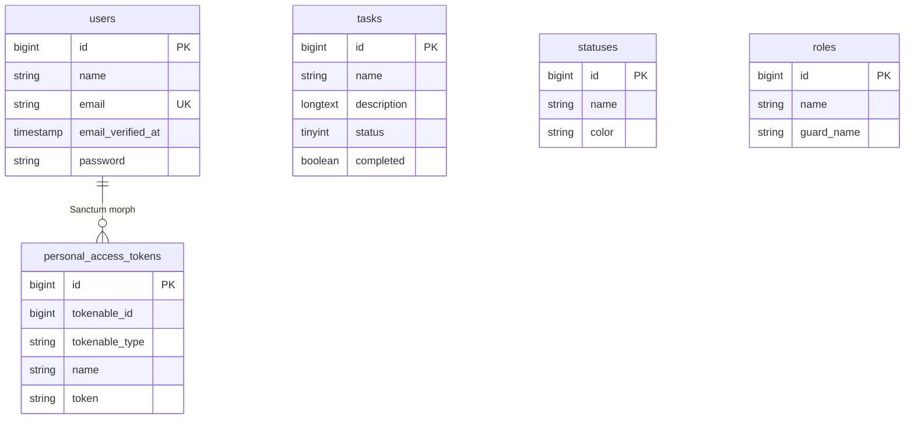

# Database Schema — Task Manager

> تحلیل بر اساس migrations، models، و seeders — 2026-07-12

---

## جداول موجود

| Table | Model | Migration | فعال در کد |
|-------|-------|-----------|------------|
| `users` | `User` | `0001_01_01_000000_create_users_table.php` | ✅ |
| `tasks` | `Task` | `2026_05_29_085546_create_tasks_table.php` | ✅ |
| `statuses` | `Status` | `2026_05_29_091832_create_statuses_table.php` | ⚠️ seed فقط |
| `roles` | Spatie `Role` | `2026_06_16_201701_create_permission_tables.php` | ⚠️ API read |
| `permissions` | Spatie `Permission` | همان migration | ❌ استفاده نشده |
| `model_has_roles` | — | همان migration | ❌ |
| `model_has_permissions` | — | همان migration | ❌ |
| `role_has_permissions` | — | همان migration | ❌ |
| `personal_access_tokens` | — | `2026_06_22_192003_create_personal_access_tokens_table.php` | ✅ Sanctum |
| `sessions` | — | users migration | ✅ |
| `password_reset_tokens` | — | users migration | ✅ |
| `cache` / `cache_locks` | — | `0001_01_01_000001_create_cache_table.php` | ✅ |
| `jobs` / `job_batches` / `failed_jobs` | — | `0001_01_01_000002_create_jobs_table.php` | ⚠️ آماده |

---

## جزئیات جداول دامنه

### `users`

| Field | Type | Notes |
|-------|------|-------|
| `id` | bigint PK | |
| `name` | string | |
| `email` | string unique | |
| `email_verified_at` | timestamp nullable | |
| `password` | string | cast: hashed |
| `remember_token` | string | |
| `timestamps` | | |

**Relationships (Model):**
- `hasMany(Task)` — ⚠️ **ستون `user_id` در `tasks` وجود ندارد**

---

### `tasks`

| Field | Type | Notes |
|-------|------|-------|
| `id` | bigint PK | |
| `name` | string | required در API |
| `description` | longText | required در API |
| `status` | tinyInteger default 1 | ⚠️ **نه FK به `statuses`** |
| `completed` | boolean default false | |
| `timestamps` | | |

**Relationships (Model — ناهماهنگ با DB):**
- `belongsTo(User)` — ❌ بدون `user_id`
- `belongsTo(Status)` — ❌ `status` integer است نه `status_id`

**Mass assignment (`$fillable`):** `name`, `description`, `status`, `completed`

---

### `statuses`

| Field | Type | Notes |
|-------|------|-------|
| `id` | bigint PK | |
| `name` | string | |
| `color` | string | |
| `timestamps` | | |

**Seeded values:** `to do`, `in Progress`, `completed`, `hold`

**Relationships (Model):**
- `hasMany(Task)` — ❌ FK در `tasks` وجود ندارد

---

### `Project` Model

- فایل: `app/Models/Project.php` — **کلاس خالی**
- **Migration وجود ندارد**
- **جدول `projects` وجود ندارد**

---

## موجودیت‌های Task Manager — وضعیت

| Concept | Exists? | Evidence |
|---------|---------|----------|
| User | ✅ Confirmed | `users` table, `User` model |
| Workspace / Team | ❌ Missing | — |
| Project | ❌ Skeleton only | Empty `Project` model, no migration |
| Task | ✅ Confirmed | `tasks` table, API CRUD |
| Task Status | ⚠️ Partial | `statuses` table seeded; `tasks.status` integer جدا |
| Priority | ❌ Missing | — |
| Assignee | ❌ Missing | No `user_id` on tasks |
| Creator | ❌ Missing | — |
| Due date | ❌ Missing | — |
| Comment | ❌ Missing | — |
| Attachment | ❌ Missing | — |
| Label / Tag | ❌ Missing | — |
| Activity log | ❌ Missing | — |
| Notification (feature) | ❌ Missing | — |

---

## ER Diagram (فقط روابط تأییدشده)



> **توجه:** خطوط رابطه `User → Task` و `Status → Task` در مدل تعریف شده‌اند ولی در schema دیتابیس **FK وجود ندارد** — در نمودار بالا عمداً حذف شده‌اند.

---

## ناهماهنگی‌های مهم Schema

### 1. `tasks.status` vs `statuses` table

| لایه | انتظار |
|------|--------|
| Migration | `status` = `tinyInteger` (مقدار عددی 1) |
| Model | `status()` = `belongsTo(Status::class)` — نیاز به `status_id` |
| Controller validation | `'status' => 'nullable|string'` |
| API response | `"status": 1` (integer) |

**وضعیت:** Broken / inconsistent

### 2. `Task::user()` بدون `user_id`

```php
// app/Models/Task.php:21-24
public function user(): BelongsTo
{
    return $this->belongsTo(User::class);
}
```

Migration `create_tasks_table` ستون `user_id` ندارد.

### 3. `Status::$fillable` فقط `name`

Seeder مقدار `color` می‌دهد (`DatabaseSeeder:31-47`) — کار می‌کند چون factory/state مستقیم set می‌کند، ولی `color` در `$fillable` نیست (mass assignment از API مسدود می‌شود).

### 4. `StatusFactory` خالی

```php
// database/factories/StatusFactory.php:20-22
return [
    //
];
```

### 5. `TaskSeeder` خالی

`database/seeders/TaskSeeder.php` — متد `run()` خالی است.

---

## Index و FK

| Issue | Severity |
|-------|----------|
| No `user_id` FK on tasks | Important |
| No `status_id` FK on tasks | Important |
| No index on `tasks.status` | Optional (جدول کوچک) |
| Permission tables — standard Spatie indexes | OK |
