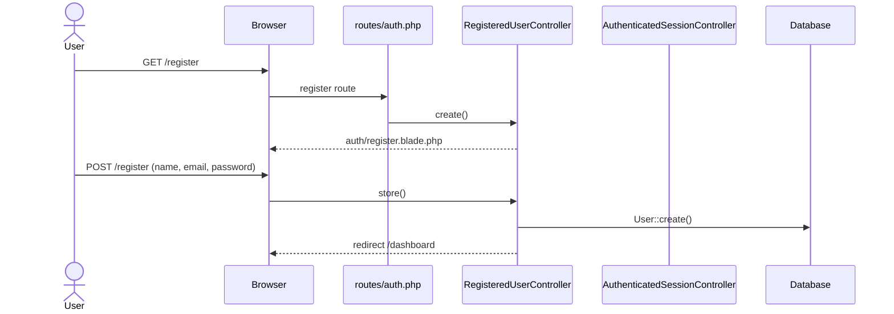
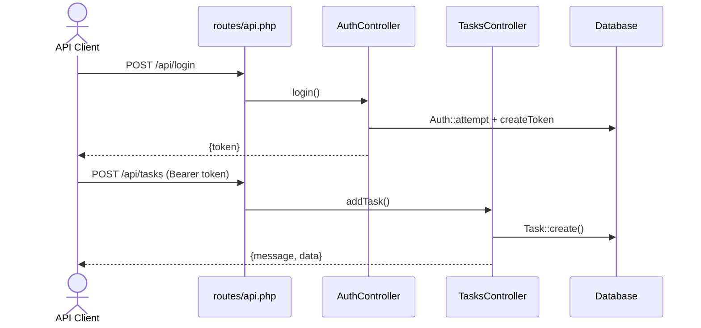
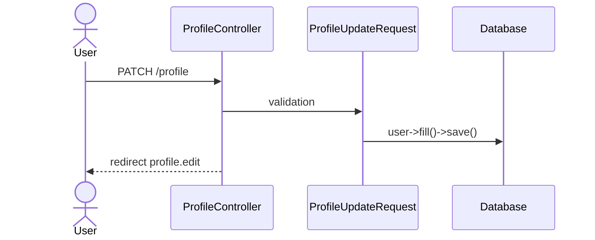

# Feature Status — Task Manager MVP

> هر نتیجه با مسیر فایل و سطح اطمینان مشخص شده است.

---

## Legend

| Status | معنی |
|--------|------|
| ✅ Complete | جریان کامل route → controller → model → response |
| ⚠️ Partial | بخشی کار می‌کند؛ ناقص یا ناهماهنگ |
| 🦴 Skeleton | فایل/ساختار هست؛ منطق نیست |
| ❌ Not implemented | وجود ندارد |
| ❓ Uncertain | نیاز به تأیید دستی |

---

## Feature Completeness Matrix

| Module | Expected MVP capability | Current status | Evidence | Missing work | Risk |
|--------|------------------------|----------------|----------|--------------|------|
| Project setup | Laravel + deps runnable | **Mostly done** | `composer.json`, migrate+seed OK, tests pass | README سفارشی، Docker/CI | Low |
| Authentication | Login/register | **Mostly done** | Breeze `routes/auth.php`, 19 auth tests pass | یکپارچگی web/API auth | Medium |
| User profile | Edit profile, password, delete | **Done** | `ProfileController`, `ProfileTest` (5 tests) | — | Low |
| Workspace/team | Multi-tenant teams | **Not started** | — | Migration, models, UI | High (if needed) |
| Project management | CRUD projects | **Started incomplete** | `Project.php` خالی، بدون migration | همه چیز | High |
| Task CRUD | Create/read/update/delete tasks | **In progress** | `TasksController`, `routes/api.php` — API تست شد | UI، scoping، schema fix | High |
| Task assignment | Assign to user | **Not started** | `Task::user()` بدون `user_id` | migration + logic | High |
| Task statuses | Status workflow | **Started incomplete** | `statuses` seeded; `tasks.status` integer | FK + controller sync | High |
| Task priorities | Priority field | **Not started** | — | migration, model, UI | Medium |
| Due dates | due_date on tasks | **Not started** | — | migration, validation | Medium |
| Comments | Task comments | **Not started** | — | model, migration, UI | Medium |
| Labels/tags | Categorization | **Not started** | — | — | Low |
| Task filtering/search | Filter/list | **Not started** | `getAll()` = `Task::all()` | query scopes, params | Medium |
| Authorization | Role-based access | **Started incomplete** | Spatie installed, `HasRoles` on User | policies, permission checks | High |
| Validation | Input validation | **In progress** | Task API inline validation; Breeze FormRequests | FormRequest classes for API | Medium |
| Error handling | Consistent errors | **Started incomplete** | برخی 404 بدون status code | API standards | Medium |
| Notifications | User notifications | **Not started** | — | — | Low |
| Dashboard | Task overview | **Started incomplete** | `dashboard.blade.php` — فقط login message | task widgets | Medium |
| Frontend usability | Task UI | **Started incomplete** | Breeze UI کامل؛ بدون task pages | task views + JS | High |
| Tests | Feature coverage | **Started incomplete** | 25 tests — auth/profile only | Task, Role, API tests | High |
| Seed/demo data | Demo tasks/users | **Started incomplete** | 4 statuses + 1 user | tasks seed, roles seed | Low |
| Documentation | Project docs | **Not started** → **Done** | این فایل‌ها | README update | Low |
| Deployment | Production ready | **Not started** | بدون Docker/CI/Nginx config | infra setup | Medium |

---

## Route Inventory

### Web Routes (`routes/web.php`, `routes/auth.php`)

| Method | URI | Name | Controller | Middleware | Auth | Status |
|--------|-----|------|------------|------------|------|--------|
| GET | `/` | — | Closure → welcome | — | No | ✅ Complete |
| GET | `/dashboard` | dashboard | Closure → dashboard | auth, verified | Yes | 🦴 Skeleton UI |
| GET | `/profile` | profile.edit | ProfileController@edit | auth | Yes | ✅ Complete |
| PATCH | `/profile` | profile.update | ProfileController@update | auth | Yes | ✅ Complete |
| DELETE | `/profile` | profile.destroy | ProfileController@destroy | auth | Yes | ✅ Complete |
| GET | `/register` | register | RegisteredUserController@create | guest | No | ✅ Complete |
| POST | `/register` | — | RegisteredUserController@store | guest | No | ✅ Complete |
| GET | `/login` | login | AuthenticatedSessionController@create | guest | No | ✅ Complete |
| POST | `/login` | — | AuthenticatedSessionController@store | guest | No | ✅ Complete |
| POST | `/logout` | logout | AuthenticatedSessionController@destroy | auth | Yes | ✅ Complete |
| GET | `/forgot-password` | password.request | PasswordResetLinkController@create | guest | No | ✅ Complete |
| POST | `/forgot-password` | password.email | PasswordResetLinkController@store | guest | No | ✅ Complete |
| GET | `/reset-password/{token}` | password.reset | NewPasswordController@create | guest | No | ✅ Complete |
| POST | `/reset-password` | password.store | NewPasswordController@store | guest | No | ✅ Complete |
| GET | `/verify-email` | verification.notice | EmailVerificationPromptController | auth | Yes | ✅ Complete |
| GET | `/verify-email/{id}/{hash}` | verification.verify | VerifyEmailController | auth, signed, throttle | Yes | ✅ Complete |
| POST | `/email/verification-notification` | verification.send | EmailVerificationNotificationController@store | auth, throttle | Yes | ✅ Complete |
| GET | `/confirm-password` | password.confirm | ConfirmablePasswordController@show | auth | Yes | ✅ Complete |
| POST | `/confirm-password` | — | ConfirmablePasswordController@store | auth | Yes | ✅ Complete |
| PUT | `/password` | password.update | PasswordController@update | auth | Yes | ✅ Complete |

### API Routes (`routes/api.php`)

| Method | URI | Name | Controller | Middleware | Auth | Status |
|--------|-----|------|------------|------------|------|--------|
| POST | `/api/login` | — | AuthController@login | — | No | ⚠️ Partial (no register/logout) |
| GET | `/api/tasks` | Tasks | TasksController@getAll | auth:sanctum | Token | ⚠️ Partial |
| GET | `/api/tasks/{id}` | Get One Task | TasksController@getOne | auth:sanctum | Token | ⚠️ Partial |
| POST | `/api/tasks` | Add Task | TasksController@addTask | auth:sanctum | Token | ⚠️ Partial |
| PUT | `/api/tasks/{id}` | Update Task | TasksController@editTask | auth:sanctum | Token | ⚠️ Partial |
| DELETE | `/api/tasks/{id}` | Delete Task | TasksController@deleteTask | auth:sanctum | Token | ⚠️ Partial |
| GET | `/api/roles` | Roles | RolesController@getAll | auth:sanctum | Token | ⚠️ Partial |
| POST | `/api/roles` | Add Role | RolesController@addRole | auth:sanctum | Token | ❌ Broken |

---

## Feature Details

### ✅ Authentication (Web) — Complete

**Flow traced:**
1. `GET /login` → `AuthenticatedSessionController@create` → `auth/login.blade.php`
2. `POST /login` → `LoginRequest` (rate limit, validation) → `Auth::attempt` → session regenerate → redirect dashboard
3. Tests: `tests/Feature/Auth/*` — 19 tests pass

**نکته:** `User` مدل `MustVerifyEmail` را implement نمی‌کند (خط comment شده در `User.php:5`) ولی route dashboard middleware `verified` دارد — کاربران تازه‌ثبت‌نام‌شده به verify-email هدایت می‌شوند.

---

### ⚠️ Authentication (API) — Partial

**Flow traced:**
1. `POST /api/login` → `AuthController@login`
2. Validation: `email`, `password`
3. `Auth::attempt` → `createToken('task-manager-token')` → JSON `{token}`
4. Protected routes: `auth:sanctum` middleware

**Missing:** API register, logout (token revoke), refresh, error status codes (401 بدون code صریح در unauthorized)

---

### ⚠️ Task API — Partial

**Flow traced (تأیید با HTTP test 2026-07-12):**

| Action | Route | Validation | DB | Response |
|--------|-------|------------|-----|----------|
| List | GET /api/tasks | — | `Task::all()` | JSON `[[...]]` — format اشتباه |
| Show | GET /api/tasks/{id} | — | `Task::find($id)` | JSON object یا 404 |
| Create | POST /api/tasks | name, description required | `Task::create` | 200 + message |
| Update | PUT /api/tasks/{id} | all nullable | `findOrFail->update` | 200 یا 500 |
| Delete | DELETE /api/tasks/{id} | — | `find->delete` | 200 حتی برای not found |

**Issues:**
- بدون فیلتر کاربر — همه taskها برای همه قابل مشاهده
- `status` validation string ولی DB integer
- Unused import: `TaskListExtension` در `TasksController.php:7`
- بدون Policy/Permission check

---

### ❌ Roles API — Broken (addRole)

```php
// RolesController.php:26-31
public function addRole(Request $request)
{
    $validate = $request->validate(['name' => 'required']);
    // هیچ create، هیچ response — متد خالی تمام می‌شود
}
```

`getAll` کار می‌کند — لیست خالی یا roles موجود را برمی‌گرداند.

---

### 🦴 Dashboard — Skeleton

`resources/views/dashboard.blade.php` — فقط `"You're logged in!"` — بدون task data.

---

### ❌ Task UI — Not implemented

جستجو در `resources/views` برای `task`/`Task` — **بدون نتیجه**.

---

## User Flows (تأییدشده)

### Flow 1: Web Register & Login



### Flow 2: API Login + Create Task



### Flow 3: Profile Update



---

## Implemented vs Missing Summary

| ✅ Implemented | ⚠️ Partial | ❌ Missing |
|---------------|-----------|-----------|
| Web auth (Breeze) | API auth (login only) | Task UI |
| Profile management | Task API CRUD | Project feature |
| Sanctum token auth | Status system | Assignment |
| Status seed data | Roles/Permissions | Comments, tags, due dates |
| Basic dashboard page | Dashboard content | Filtering/search |
| 25 auth/profile tests | Schema consistency | Task tests |
| | Response format | Deployment infra |
