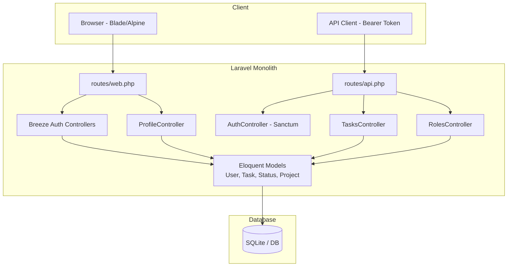

# Project Overview — Task Manager MVP

> آخرین بازرسی: 2026-07-12  
> وضعیت: **تحلیل از روی کد — بدون تغییر در application code**

---

## هدف پروژه

ساخت یک **MVP از اپلیکیشن مدیریت وظایف (Task Management)** با Laravel. در وضعیت فعلی، پروژه بیشتر شبیه یک **اسکلت Laravel 12 + Breeze** است که بخش‌های اولیه‌ی API برای Task و Role اضافه شده، اما **هسته‌ی محصول (مدیریت وظایف از طریق UI)** هنوز پیاده‌سازی نشده است.

---

## Technology Stack

| لایه | فناوری | نسخه (تأییدشده) |
|------|---------|------------------|
| Backend | Laravel | v12.59.0 (`composer.lock`) |
| Runtime | PHP | ^8.2 (`composer.json`) |
| Auth (Web) | Laravel Breeze | ^2.4 (dev) — Session-based |
| Auth (API) | Laravel Sanctum | ^4.3 — Bearer Token |
| Authorization | spatie/laravel-permission | ^6.25 |
| Frontend | Blade + Tailwind CSS + Alpine.js | Tailwind 3.x, Alpine 3.4 |
| Build | Vite | ^7.0.7 |
| Testing | Pest + PHPUnit | Pest ^3.8 |
| DB (پیش‌فرض) | SQLite | `DB_CONNECTION=sqlite` در `.env.example` |
| Cache / Session / Queue | Database drivers | `.env.example` |

---

## معماری فعلی

### نوع اپلیکیشن

**Hybrid Monolith** — یک monolith Laravel با **دو مسیر احراز هویت جدا**:

1. **Web (Breeze):** Session + Blade views
2. **API (`/api/*`):** Sanctum Bearer Token

این دو مسیر **به هم متصل نیستند**؛ کاربر web می‌تواند login کند اما به API دسترسی ندارد مگر token جداگانه بگیرد.

### لایه‌های اصلی

```
HTTP Request
    → routes/web.php | routes/api.php
    → Middleware (auth, verified, auth:sanctum)
    → Controller (مستقیم — بدون Service/Repository)
    → Eloquent Model
    → Database
    → JSON Response | Blade View
```

### الگوهای معماری

| الگو | وضعیت |
|------|--------|
| MVC (Laravel default) | ✅ تأییدشده |
| Service Layer | ❌ وجود ندارد (`app/Services/` نیست) |
| Repository Pattern | ❌ وجود ندارد |
| Action Classes | ❌ وجود ندارد |
| DTO | ❌ وجود ندارد |
| Policy / Gate | ❌ وجود ندارد (`app/Policies/` نیست) |
| Event-driven | ⚠️ فقط `Registered` event در Breeze |
| Domain-oriented | ❌ وجود ندارد |

### نمودار معماری سطح بالا



---

## ماژول‌های اصلی

| ماژول | وضعیت | توضیح |
|-------|--------|-------|
| Authentication (Web) | ✅ کامل | Breeze: register, login, logout, password reset, email verification |
| Authentication (API) | ⚠️ نیمه‌کاره | فقط `POST /api/login` |
| User Profile | ✅ کامل | ویرایش پروفایل، تغییر رمز، حذف حساب |
| Task API | ⚠️ نیمه‌کاره | CRUD JSON بدون scoping کاربر |
| Status | ⚠️ نیمه‌کاره | جدول و seed وجود دارد؛ به Task متصل نیست |
| Roles/Permissions | ⚠️ نیمه‌کاره | Spatie نصب شده؛ `addRole` ناقص |
| Project | ❌ اسکلت | مدل خالی بدون migration/route |
| Task UI | ❌ وجود ندارد | هیچ view مرتبط با task نیست |
| Dashboard | ⚠️ اسکلت | فقط پیام "You're logged in!" |

---

## قابلیت‌های فعلی (تأییدشده)

1. ثبت‌نام و ورود از طریق مرورگر (`routes/auth.php`)
2. تأیید ایمیل (middleware `verified` روی dashboard — اما `User` از `MustVerifyEmail` implement نمی‌کند)
3. مدیریت پروفایل کاربر
4. API login و دریافت Sanctum token
5. API CRUD برای Task (با مشکلات schema و response format)
6. API لیست Roleها
7. Seed اولیه: 4 Status + 1 User

---

## دایرکتوری‌های مهم

```
app/
├── Http/Controllers/     # TasksController, AuthController, RolesController, Breeze Auth
├── Http/Requests/        # LoginRequest, ProfileUpdateRequest
├── Models/               # User, Task, Status, Project (خالی)
└── View/Components/      # AppLayout, GuestLayout

database/
├── migrations/           # users, tasks, statuses, permissions, sanctum tokens
├── seeders/              # DatabaseSeeder (فعال), TaskSeeder (خالی)
└── factories/            # UserFactory, TaskFactory, StatusFactory

resources/views/
├── auth/                 # صفحات Breeze
├── profile/              # مدیریت پروفایل
├── dashboard.blade.php   # داشبورد خالی
└── layouts/              # app, guest, navigation

routes/
├── web.php               # dashboard, profile
├── api.php               # tasks, roles, api login
└── auth.php              # Breeze routes

tests/Feature/Auth/       # 25 تست — همه pass
```

---

## جریان‌های درخواست اصلی

### Web Login
```
GET /login → AuthenticatedSessionController@create → auth/login.blade.php
POST /login → LoginRequest → Auth::attempt → redirect /dashboard
```

### API Task Create
```
POST /api/login → AuthController@login → Sanctum token
POST /api/tasks (Bearer token) → TasksController@addTask → Task::create → JSON
```

---

## محدودیت‌های شناخته‌شده

1. **دو سیستم auth جدا** — web session و API token بدون یکپارچگی
2. **Task و Status ناهماهنگ** — `tasks.status` integer است، `statuses` جدول جداست
3. **بدون user_id روی tasks** — رابطه `Task::user()` در مدل هست ولی ستون در migration نیست
4. **بدون UI برای Task** — API-only
5. **RolesController@addRole** — validate می‌کند ولی role ایجاد نمی‌کند
6. **Project** — مدل خالی بدون migration
7. **README** — هنوز متن پیش‌فرض Laravel است
8. **بدون Docker/CI/CD**

---

## سطح بلوغ پروژه

**Early MVP / Prototype** — زیرساخت Laravel و auth آماده است؛ هسته‌ی task management نیمه‌کاره و UI محصول وجود ندارد.
